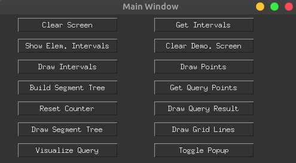

# Computational Geometry - Course Project

## Problem Statement
Given a set of n non-intersecting line segments of arbitrary orientation, implement the Segment Tree data structure to answer the following queries : Given a vertical line segment R, report all the segments that intersect R. Also implement the algorithm for the one dimensional variant of the problem - Given a set of intervals, report all the intervals that contain a query point.

---

This file is help the user interact with the modules. The implementation for both the cases, (i.e., One Dimensional variant and Two Dimensional variant) has been done separately. This has been stored in the directories with the corresponding names. The interface for both the implementations is quite similar, and the steps to use it are as follows:

### Running the applicatino
Use ``` python main.py ``` to run the application. <br>
This shall open 3 windows, a *Main Window*, *Screen* and *Demonstration Screen*. All the inputs are to be given on the *Screen Window*, and the *Demonstration Screen* window is to facilitate interactive visualization of the algorithm. <br>
On executing the above command, the *Main Window* shall appear as shown below.

---
<br> 

--- 
Most of the buttons on this screen are rather intuitive, however, we shall go over the functionality of each of these.

* **Clear Screen**: Clears the *Screen Window*, and also resets all the inputs that have been provided up until then.
* **Get Intervals**: The user can draw input-intervals on the *Screen Window*. After the intervals have been drawn, this button is to register all the intervals as the input for our algorithm.
* **Show Elem. Intervals**: This button takes the provided input-intervals, obtains the corresponding set of elementary intervals, and displays it on the *Demonstration Screen Window*.
* **Clear Demo. Screen**: This button clears the *Demonstration Screen Window*.
* **Draw Intervals**: This button is to toggle back to drawing input-intervals, from drawing query points.
* **Draw Points**: This button is to toggle back to drawing query-points, from drawing input intervals.
* **Build Segment Tree**: This button takes the input intervals, and constructs the corresponding segment tree.
* **Get Query Points**: The user can draw query-points on the *Screen Window*. After hte points have been drawm, this button is to register all the points in the query set for our algorithm.
* **Reset Counter**: This resets the position of the counter, which cyclically moves in the query-point set.
* **Draw Query Result**: This visualizes the result corresponding to a single query point. This is done using a counter, which cylically moves in the query-point set, and every time this button is clicked, the pointer moves one unit forward.
* **Draw Segment Tree**: This draws the corresponding segment tree. User can also interactively click on each node of the segment tree to get more information regarding it.
* **Draw Grid Lines**: Draws the grid lines on the *Demonstration Screen Window*.
* **Visualize Query**: Visualizes the query path in the segment tree, for a single query (same as *Draw Query Result*).
* **Toggle popup**: This is to toggle between making the *Demonstration Screen Window* accept mouse click input (which is required to interact with the segment tree nodes).

The above picture corresponds to the application for the 1-Dimensional scenario, but it is very similar for the 2-Dimensional case as well.